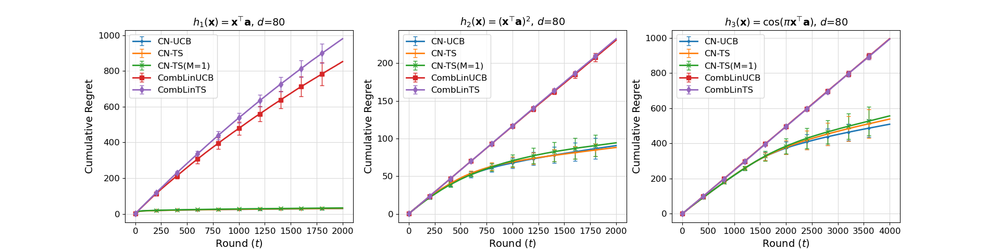
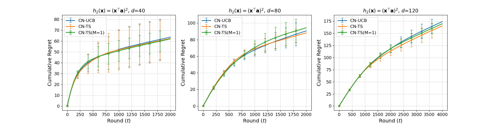

# Code for Combinatorial Neural Bandits

This repository is the official implementation of [Combinatorial Neural Bandits](https://arxiv.org/abs/--). 

## Requirements

- The code uses `PyTorch 1.7.1`.
- We used an Anaconda environment for the experiment. Use the following to setup the modules & dependencies:
```setup
conda env create -f environment.yml
```
- Or you may use pip requirements:
```setup
 pip install -r requirements.txt
```

## Code Description
- `experiment.py`: Runs the experiments. Refer to [Details](#details).
- `combinatorial_bandit.py`: Defines the combinatorial bandit.
- `options.py`: Defines the agent's strategies: Neural or Linear / UCB or TS (single sampling or optimistic sampling).
- `plot_results.py`: Plots the experiment results.

## Details
### experiment.py
`experiment.py` has 22 argument parsers.

Related to the Algorithm
| Argparse Command | Default | Note |
|---|---|---|
| --neural_or_lin | nueral | 'neural' for neural bandit, 'lin' for linear bandit |
| --ucb_or_ts | UCB | 'UCB' for UCB, 'TS' for TS |

Related to the Score Function
| Argparse Command | Default | Note |
|---|---|---|
| --score_ftn | h2 | 'h1', 'h2' or 'h3'. 'h1': linear, 'h2': quadratic, 'h3': cosine |
| --noise_coef | 0.01 | the intesity of the noise of the scores, *cf. score = h(x) + noise* |

Related to Arm or Feature Vector
| Argparse Command | Default | Note |
|---|---|---|
| --unif | False | If True, sample feature vectors from uniform dist. Else, sample feature vectors from normal dist. |
| --n_arms | 20 | *N* |
| --n_features | 20 | *d* |

Related to Combinatorial Selection or Multiple Sampling
| Argparse Command | Default | Note |
|---|---|---|
| --n_assortment | False | *K* |
| --n_samples | 1 | *M*. Sampling number for ***CN-TS*** |

Related to Rounds per Simulation / Simulations per Experiment
| Argparse Command | Default | Note |
|---|---|---|
| --total_rounds | 2000 | *T* |
| --n_sim | 20 | Number of simulations for one experiment. Average the simulation results for final experiment result. |

Related to Coefficients
| Argparse Command | Default | Note |
|---|---|---|
| --reg_factor | 1.0 | *lambda* |
| --delta | 0.1 | *delta* |
| --nu | 1.0 | *nu* |
| --gamma | 1.0 | *gamma* |

Related to the Neural Network
| Argparse Command | Default | Note |
|---|---|---|
| --hidden_layer_width | 100 | *m* |
| --epochs | 100 |  |
| --dropout | 0.0 |  |
| --learning_rate | 0.01 |  |
| --training_period | 10 | update the network only when "round % training_period == 0" |
| --training_window | 100 | use the recent "training_window" rewards for updating the network |

Filename to Save the Result
| Argparse Command | Default | Note |
|---|---|---|
| --save | '' |  |

### plot_results.py
`plot_results.py` has 1 argument parser.

| Argparse Command | Default | Note |
|---|---|---|
| --exp | 1 | Experiment number. '1' for plotting the results of Experiment 1, '2' for plotting the results of Experiment 2 |


## How to Run the Code

### Experiment 1
Experiment 1 compares ***CN-UCB***, ***CN-TS*** (optimistic sampling) and ***CN-TS(M=1)*** (single sampling) with prior linear combinatorial algorithms, ***CombLinUCB*** and ***CombLinTS***.  The score functions are *{h1, h2, h3}* and the feature dimension is *d=80*.

To run Experiment 1 in the paper, run the following commands:

***h1 (linear)***
- CNUCB
```bash
python3 experiment.py \
--neural_or_lin neural --ucb_or_ts UCB \
--score_ftn h1 --n_features 80 \
--total_rounds 2000 --save exp1_h1_CNUCB
```

- CNTS
```bash
python3 experiment.py \
--neural_or_lin neural --ucb_or_ts TS \
--score_ftn h1 --n_features 80 --n_samples 10 \
--total_rounds 2000 --save exp1_h1_CNTS
```

- CNTS(M=1)
```bash
python3 experiment.py \
--neural_or_lin neural --ucb_or_ts TS \
--score_ftn h1 --n_features 80 --n_samples 1 \
--total_rounds 2000 --save exp1_h1_CNTS_M1
```

- CombLinUCB
```bash
python3 experiment.py \
--neural_or_lin lin --ucb_or_ts UCB \
--score_ftn h1 --n_features 80 \
--total_rounds 2000 --save exp1_h1_CombLinUCB
```

- CombLinTS
```bash
python3 experiment.py \
--neural_or_lin lin --ucb_or_ts TS \
--score_ftn h1 --n_features 80 \
--total_rounds 2000 --save exp1_h1_CombLinTS
```

***h2 (linear)***
- CNUCB
```bash
python3 experiment.py \
--neural_or_lin neural --ucb_or_ts UCB \
--score_ftn h2 --n_features 80 \
--total_rounds 2000 --save exp1_h2_CNUCB
```

- CNTS
```bash
python3 experiment.py \
--neural_or_lin neural --ucb_or_ts TS \
--score_ftn h2 --n_features 80 --n_samples 10 \
--total_rounds 2000 --save exp1_h2_CNTS
```

- CNTS(M=1)
```bash
python3 experiment.py \
--neural_or_lin neural --ucb_or_ts TS \
--score_ftn h2 --n_features 80 --n_samples 1 \
--total_rounds 2000 --save exp1_h2_CNTS_M1
```

- CombLinUCB
```bash
python3 experiment.py \
--neural_or_lin lin --ucb_or_ts UCB \
--score_ftn h2 --n_features 80 \
--total_rounds 2000 --save exp1_h2_CombLinUCB
```

- CombLinTS
```bash
python3 experiment.py \
--neural_or_lin lin --ucb_or_ts TS \
--score_ftn h2 --n_features 80 \
--total_rounds 2000 --save exp1_h2_CombLinTS
```

***h3 (cosine)***
- CNUCB
```bash
python3 experiment.py \
--neural_or_lin neural --ucb_or_ts UCB \
--score_ftn h3 --n_features 80 \
--total_rounds 4000 --save exp1_h3_CNUCB
```

- CNTS
```bash
python3 experiment.py \
--neural_or_lin neural --ucb_or_ts TS \
--score_ftn h3 --n_features 80 --n_samples 10 \
--total_rounds 4000 --save exp1_h3_CNTS
```

- CNTS(M=1)
```bash
python3 experiment.py \
--neural_or_lin neural --ucb_or_ts TS \
--score_ftn h3 --n_features 80 --n_samples 1 \
--total_rounds 4000 --save exp1_h3_CNTS_M1
```

- CombLinUCB
```bash
python3 experiment.py \
--neural_or_lin lin --ucb_or_ts UCB \
--score_ftn h3 --n_features 80 \
--total_rounds 4000 --save exp1_h3_CombLinUCB
```

- CombLinTS
```bash
python3 experiment.py \
--neural_or_lin lin --ucb_or_ts TS \
--score_ftn h3 --n_features 80 \
--total_rounds 4000 --save exp1_h3_CombLinTS
```

### Experiment 2
Experiment 2 compares ***CN-UCB***, ***CN-TS*** (optimistic sampling) and ***CN-TS(M=1)*** (single sampling) as the feature dimension increases *d={40, 80, 120}*.  The score function is quadratic *h2*.

To run Experiment 2 in the paper, run the following commands:

***d=40***
- CNUCB
```bash
python3 experiment.py \
--neural_or_lin neural --ucb_or_ts UCB \
--score_ftn h2 --n_features 40 \
--total_rounds 2000 --save exp2_40_CNUCB
```

- CNTS
```bash
python3 experiment.py \
--neural_or_lin neural --ucb_or_ts TS \
--score_ftn h2 --n_features 40 --n_samples 10 \
--total_rounds 2000 --save exp2_40_CNTS
```

- CNTS(M=1)
```bash
python3 experiment.py \
--neural_or_lin neural --ucb_or_ts TS \
--score_ftn h2 --n_features 40 --n_samples 1 \
--total_rounds 2000 --save exp2_40_CNTS_M1
```

***d=80***
Use the results of Experiment 1, *h2*.

***d=120***
- CNUCB
```bash
python3 experiment.py \
--neural_or_lin neural --ucb_or_ts UCB \
--score_ftn h2 --n_features 120 \
--total_rounds 4000 --save exp2_120_CNUCB
```

- CNTS
```bash
python3 experiment.py \
--neural_or_lin neural --ucb_or_ts TS \
--score_ftn h2 --n_features 120 --n_samples 10 \
--total_rounds 4000 --save exp2_120_CNTS
```

- CNTS(M=1)
```bash
python3 experiment.py \
--neural_or_lin neural --ucb_or_ts TS \
--score_ftn h2 --n_features 120 --n_samples 1 \
--total_rounds 4000 --save exp2_120_CNTS_M1
```

### Plot the Results
Plot the Results
After getting all of the results, use the following code to plot the results of Experiment 1 & 2:
- Experiment 1
```bash
python3 plot_results.py --exp 1
```

- Experiment 2
```bash
python3 plot_results.py --exp 2
```

## Results

Our algortihms achieves the following performance:

### Experiment 1 (score function *{h1, h2, h3}*, feature dimension *d=80*)


Compared to linear baselines, the cumulative regrets for ***CN-UCB*** and ***CN-TS*** show a sub-linear tendency even when the score function is quadratic or non-linear.
This suggests that our algorithms can be more applicable to various and complex reward functions.

### Experiment 2 (quadratic score function *h2*, feature dimension *d={40,80,120}*)


The empirical results suggest that ***CN-UCB*** and ***CN-TS*** have a scalability in feature dimension ***d*** no higher than linear.
When ***d*** is large, ***CN-TS*** shows a lower cumulative regret compared to ***CN-TS(M=1)***. 
This observation supports our claim that ***CN-TS*** secures a constant probability of optimism by drawing multiple ***M*** samples.

## Contact Info.
Please contact [Taehyun Hwang](th.hwang@snu.ac.kr) or [Kyuwook Chai](kwchai@snu.ac.kr) for anything.
